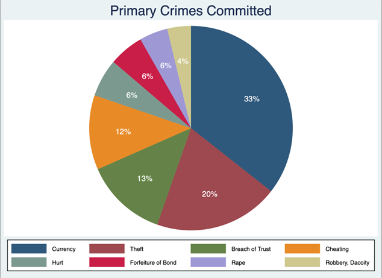
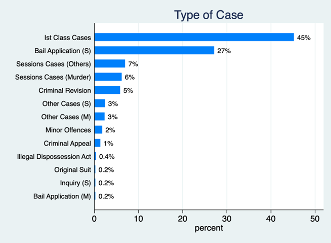
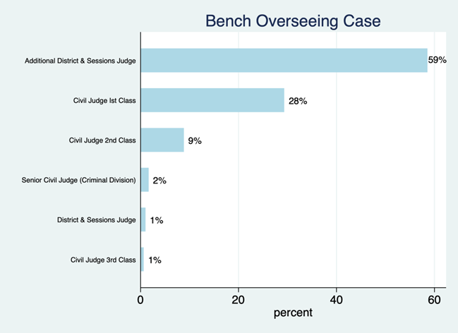

## Case Data Lahore High Court 2013 v1.0

Case-level judicial data from Lahore High Courts extracted from District Judiciary Punjab’s case management system website for the year 2013, with the aim of establishing a baseline to empirically understand Pakistan’s legal system. 

This dataset is published under the project [Pakistan Justice Data](../../README.md).

### Methodology

The data was extracted from the website using web scraping techniques. It was then cleaned and processed to make it usable for analysis. The following diagram provides an overview of the data collection methodology:

[Diagram to show data gahtering methodology](images/data_gathering.jpg)

The dataset suffered from a lack of standardization. Datapoints containing the exact same information were noted down with differing formatting styles. We used the replace command in STATA to standardize the observations. This resulted in a more uniform dataset which was easier to interpret, store and process. However, this proved to be a laborious task for two reasons: a) article numbers did not always necessarily refer to the Pakistan Penal Code - which is what we had assumed - and b) the same thing was written in so many different formats that developing an algorithm to sort it out was not feasible. Thus, a manual fuzzy matching procedure had to be applied which is not practical for larger datasets of this nature.

There were a few variables wherein information belonging to different categories (such as type of case and offense committed) was listed together. Splitting these variables meant generation of new ones which were renamed - and standardized - accordingly. An original variable of a more qualitative nature - “remarks” - was dropped since it both repeated information that was already present in the data set and attempts at making it uniform proved unsuccessful.

Once the observations for variables were formatted and uniform, we proceeded with assigning each value with a unique numeric code which is beneficial for any statistical analysis that may be conducted. Variables that had only two possible answers were coded as one and zero as they would act as dummy variables. For variables with a greater number of categories, the encode command was used There is one variable that was an exception to this - “case-no” - where we converted it from a numeric to string data using the “tostring” command since the numeric observations were being displayed as raised to the power of 10, which can Additionally, we found observations that were left blank. These were replaced with a missing value (denoted as a dot or full stop) to ensure that these data points were appropriately recognised by the data software. Whilst these steps resulted in the creation of a data set that is more human readable, the concern remains that there is repetition of information.

Lastly, all variables were assigned meaningful labels using the ‘label’ command to effectively convey what the data represented while avoiding any chances of confusion that otherwise may arise.

### Data Repository

The dataset can be accessed at [https://doi.org/10.5281/zenodo.13766895](https://doi.org/10.5281/zenodo.13766895).

[](https://doi.org/10.5281/zenodo.13766895)

### File Descriptions

The data repository contains the following files:

- raw_data_lahore_highcourt_2013_v1.xlsx: This file contains the raw data extracted from the Punjab High Court website.
- to_clean_data_lahore_highcourt_2013_v1.do: This file contains the Stata do file used to clean the raw data.
- stata_cleaned_data_lahore_highcourt_2013_v1.dta: This file contains the cleaned data in Stata format.
- cleaned_data_lahore_highcourt_2013_v1.csv: This file contains the cleaned data in CSV format. While the variables names for cleaned data are human readable and mostly made clear what information the variable contained. The variables available are as follows:
  - ``case_no``: Case Number
  - ``case_status``: Case Status
  - ``inst_no``: A unique number representing the case in the system
  - ``inst_date``: Date when the case was officially filed or registered in the court.
  - ``type_of_case``: The type or category of the case (e.g., First Class Cases, Bail Applications).
  - ``offense``: The description of crime or violation for which the case was filed (e.g., Cheating, Rape, etc).
  - ``procedure_or_documentation``: Indicates the type of procedure involved, such as pre-arrest bail or other legal processes.
  - ``fir_no``: The First Information Report (FIR) number associated with the case.
  - ``fir_year``: The year in which the FIR was registered.
  - ``police_station``: The name of the police station where the FIR was lodged.
  - ``primary_offence``: The main crime or charge the case deals with, represented by 
  - ``presiding_judge``: The name of the judge presiding over the case.
  - ``bench``: The judicial authority or composition of the bench (e.g., Civil Judge or Additional District).
  - ``decision_date``: The date when the court issued a decision or verdict.
  - ``decision_type``: The type of decision made by the court (e.g., Acquittal, Conviction).
  - ``contested``: Indicates whether the case was contested or uncontested.
  - ``acquitted_convicted``: Indicates whether the accused was acquitted or convicted.

### Data Summary

There are a total of 1429 observations. We find that 76.94% cases were disposed of between the time frame of 2020-2022.

The most frequently recurring cases have been consolidated and presented as a pie chart. As we can see, criminal offenses concerning “Currency” (33%) and “Theft” (20%) make up a significant portion of crimes. To provide further clarity on “Currency,” the Pakistan Penal Code discusses it in the context of counterfeit production and possession. “Breach of Trust” (13%) is the third most cited crime and as per the Pakistan Penal Code. It refers to the misappropriation of property, which could be linked with the larger discussion of familial disputes and inheritance laws.

The most frequently recurring cases have been consolidated and presented as a pie chart. As we can see, criminal offenses concerning “Currency” (33%) and “Theft” (20%) make up a significant portion of crimes. To provide further clarity on “Currency,” the Pakistan Penal Code discusses it in the context of counterfeit production and possession. “Breach of Trust” (13%) is the third most cited crime and as per the Pakistan Penal Code. It refers to the misappropriation of property, which could be linked with the larger discussion of familial disputes and inheritance laws.



1st Class cases (45%) - which covers civil suits - and Bail Application (S) cases (27%) were the most frequently reported type of case. 



Accordingly, these cases fall within the jurisdiction of the additional district/ district and sessions judges (59%) and first-class civil judge-cum-magistrates (29%) respectively.



### Status

In Progress

- To do: Extending analysis for a larger dataset.

### License

The data is available under the [Creative Commons Attribution Non Commercial 4.0 International](https://creativecommons.org/licenses/by-nc/4.0/legalcode) license.

### Cite as

````(bibtext)
@dataset{pasta_2024_13766895,
  author       = {Pasta, Muhammad Qasim and
                  Sahaab Bader, Sheikh and
                  Amin, Esha and
                  Fawad, Filza},
  title        = {Case Data Lahore High Court 2013 v1.0},
  month        = sep,
  year         = 2024,
  publisher    = {Data Research Lab Pakistan},
  version      = {1.0},
  doi          = {10.5281/zenodo.13766895},
  url          = {https://doi.org/10.5281/zenodo.13766895}
}
````

### Team Members

#### Principal Investigators (Corresoonding Members)

- [Muhammad Qasim Pasta](https://habib.edu.pk/SSE/muhammad-qasim-pasta/)
- [Sahaab Badar Sheikh](https://habib.edu.pk/AHSS/sahaab-sheikh/)

#### Student Researchers

- Esha Amin
- Filza Fawad

## Acknowledgements

We would like to thank [Habib University](http://habib.edu.pk) for providing funding for this part of the project under the grant [Summer Tehqiq (Research) Program 2023](https://habib.edu.pk/research-at-habib/summer-tehqiq-research-program/).

Go to: [Top](#case-data-lahore-high-court-2013-v10) | [Pakistan Justice Data](../../README.md) | [Data Research Lab - Pakistan](https://darlab-pakistan.github.io/)

<link rel="include" href="../../analytics.html">