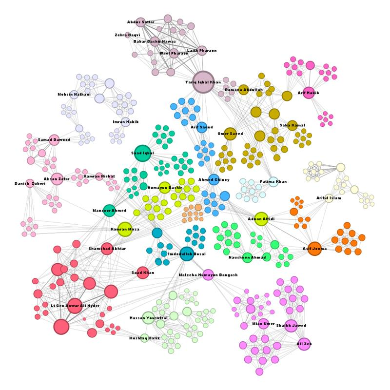
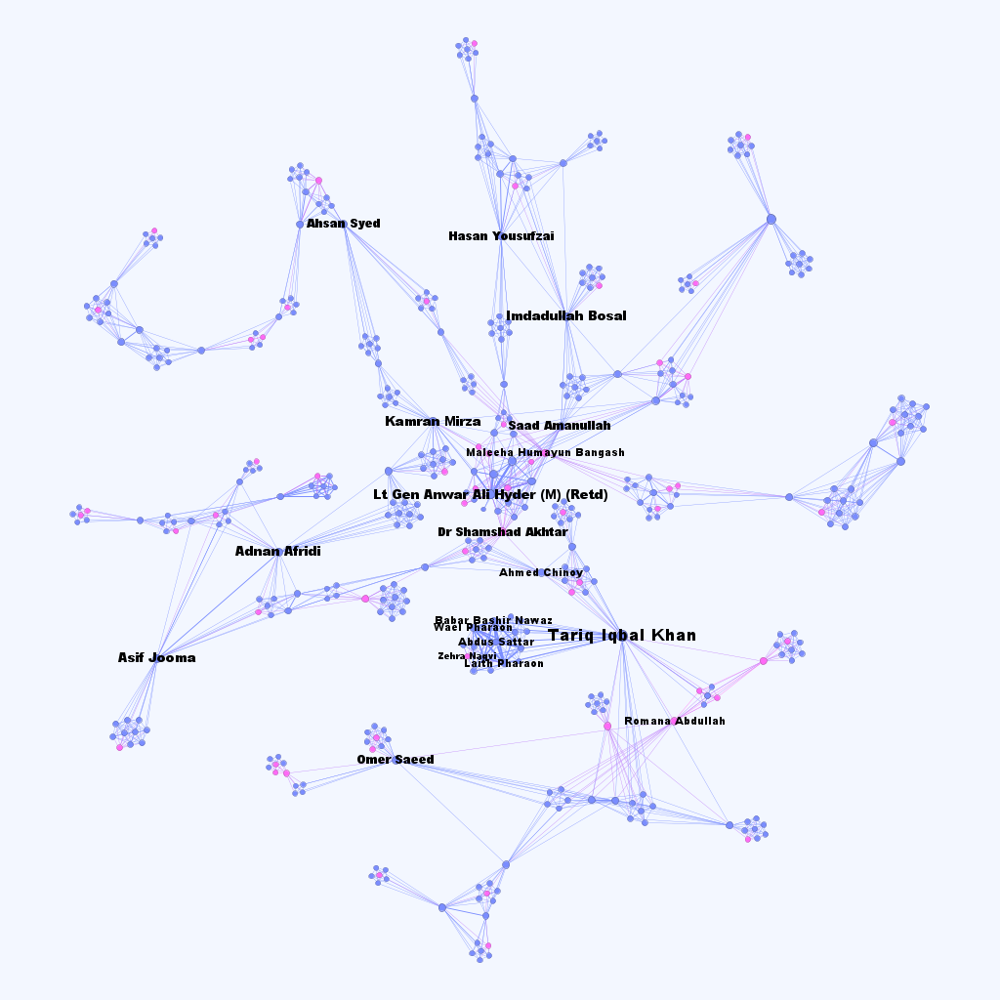
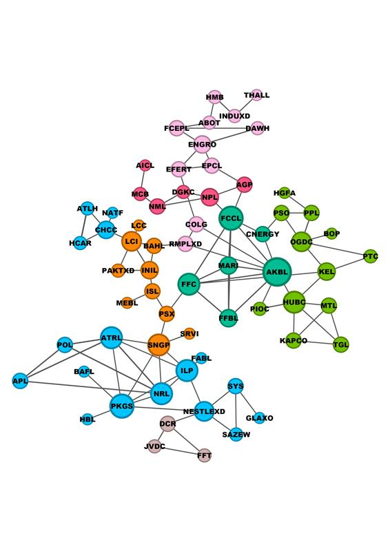

## Board Network: KSE 100 Index


Corporate boards in Pakistan remain a largely opaque and underexplored space—especially when viewed through the lens of gender and network influence. This dataset offers a first-of-its-kind Social Network Analysis (SNA) of the KSE 100 Index, the top 100 companies on the Pakistan Stock Exchange (PSX) by market capitalization. By mapping interlocking directorships and examining the presence and centrality of male and female board members, the dataset provides a structural view of how corporate power and gendered representation co-exist in Pakistan’s economic core.

Sourced entirely from public records, the data captures a snapshot of the PSX as it existed between 9th and 12th November 2024. It includes detailed information on company sectors, board memberships, and gender, enabling new forms of analysis in corporate governance, gender inclusion, and institutional interconnectivity. By releasing this dataset, we aim to foster evidence-based discussions on corporate influence, board diversity, and equity in leadership.

This dataset is published under the project [PSX Networks](../README.md).

### Methodology

The company- and director-level data were obtained through firm profiles available on the Pakistan Stock Exchange (PSX) website (https://www.psx.com.pk/). We first coded each firm listed in the KSE-100 Index according to its industry classification and legal name as reported by the PSX. Subsequently, the names of board directors were manually extracted from the official websites of these companies or from publicly available annual reports. The final dataset comprises 700 unique individuals serving as board members across one or more firms The company- and director-level data were obtained through firm profiles available on the Pakistan Stock Exchange (PSX) website. For each company in the KSE 100 Index, the industry classification and legal name, as presented on the PSX, were recorded. Company websites were manually reviewed to extract director names, resulting in over 700 unique board member entries.

The dataset was subjected to a cleaning process to ensure consistency and accuracy. Company and industry names were standardized by converting them to lowercase. Director names were cleaned to remove honorifics (e.g., “Mr.”, “Mrs.”, “Dr.”) and extraneous punctuation. Variations in name spellings (for example, “Ahmad Chinoy” and “Ahmed Chinoy”) were manually resolved, and entries were de-duplicated for directors who served on multiple boards. The gender of each board member was inferred and coded using publicly available information and name-based indicators, recognizing gender as a key dimension of analysis in this study.
The cleaned dataset was used to construct both bipartite and unipartite networks. The bipartite network connects companies to their respective directors, while the projected unipartite networks include: (1) a company-to-company network, where an edge indicates shared board members between two companies; and (2) a director-to-director network, where an edge indicates that two directors sit on the same company board. Network visualizations were generated using Gephi with the ForceAtlas 2 layout algorithm. Node sizes in the visualizations represent degree centrality, allowing us to identify key companies and individuals with high levels of connectivity. Special attention was paid to the gender distribution of central actors in the network to highlight patterns of inclusion and exclusion within corporate leadership in Pakistan.


### Data Repository

The dataset can be accessed at [https://doi.org/10.5281/zenodo.15782790](https://doi.org/10.5281/zenodo.15782790).

[](https://doi.org/10.5281/zenodo.15782790)

### File Descriptions

The dataset is provided in both CSV and GraphML formats to ensure compatibility with various network analysis tools such as Gephi, R, and Python's NetworkX. These formats allow for both quantitative exploration and visual representation of the KSE 100 board interlocks.

The CSV file contains the following attributes:
- ``Symbol``: The stock ticker symbol representing the listed company on the stock exchange (e.g., KEL, PAEL, SEARL).
- ``Company``: The full name of the company.
- ``Industry``: The sector or industry classification in which the company operates (e.g., Power Generation & Distribution, Pharmaceuticals).
- ``Director``: The name of an individual serving as a board member or director of the company.
- ``Gender``: The gender of the respective director (`M` for Male, `F` for Female).

### Data Summary

The KSE-100 director network, comprising 701 nodes and 3,121 edges, reveals a highly interconnected governance structure between companies and their board members. With a high clustering coefficient and density of 0.9, the network shows that directors are closely linked across companies, creating a tightly knit ecosystem. The average path length of 6 and a diameter of 16 align with the "six degrees of separation" concept, indicating that even distant nodes are accessible through relatively few intermediaries. However, this level of connectivity may also point toward over-centralization and a potential concentration of decision-making power.

| Network Metric           | Value  |
|--------------------------|--------|
| Nodes (Directors)        | 701    |
| Edges (shared boardship) | 3,121  |
| Average Degree           | 2.24   |
| Diameter                 | 16     |
| Average Path Length      | 6      |
| Clustering Coefficient   | 0.9    |
| Density                  | 0.9    |

In contrast, the company-to-company network, which maps shared directors between companies, is considerably more sparse. With only 112 edges among 100 nodes, the network has a low density of 0.0226 and a high diameter of 21, suggesting that most companies do not share directors directly and that governance overlap is limited. Yet, the modularity score of 1.0 indicates a highly structured and organized system, segmented into 31 communities, including 18 within a densely connected core and 13 peripheral clusters. This modular structure reflects distinct industry or influence-based groupings, offering insight into the segmented nature of corporate governance in Pakistan.
Together, the two networks highlight a dual reality of Pakistan’s corporate landscape—dense interlinkages at the individual (director) level, and sectoral or strategic separation at the company level.

| Network Metric              | Value  |
|-----------------------------|--------|
| Nodes (companies)           | 100    |
| Edges (shared directors)    | 112    |
| Density                     | 0.0226 |
| Diameter                    | 21     |
| Community Count             | 31     |
| Modularity Score            | 1.0    |
| Communities in Giant Component | 18  |
| Peripheral Communities      | 13     |

#### Visualiazation:
The following visualization represents the Board of Directors network, where each node corresponds to a person who is a member of the board of one or more companies. An edge between two directors indicates that both serve on the board of one or more companies together.


The following network also represents the Board of Directors. Female board members are shown as pink nodes. It is evident that there is very little representation of women on corporate boards.


The following network represents the company interlocking network. Each node corresponds to a company, and an edge between two companies indicates that they share at least one common director.



#### Limitations:

This dataset captures a temporal snapshot of the KSE-100 board network based on data collected between 9th and 12th November 2024, which limits its ability to reflect changes in board compositions occurring before or after this period. Additionally, the dataset focuses exclusively on the top 100 companies by market capitalization, thereby excluding smaller or mid-sized firms listed on the Pakistan Stock Exchange and limiting the generalizability of findings to the broader market. Some companies’ publicly available board member information was incomplete or outdated, which may result in underrepresentation of certain directors and affect the overall accuracy of the network . Furthermore, the dataset treats all directors equally without differentiating their specific roles or influence, such as chairpersons or independent directors, which could mask important variations in governance dynamics within the network.


### Status

The dataset is complete and no further updates are expected.

### License

The data is available under the [Creative Commons Attribution Non Commercial 4.0 International](https://creativecommons.org/licenses/by-nc/4.0/legalcode) license.

### Cite as

````(bibtext)
@dataset{aftab_2025_15782790,
  author       = {Aftab, Uraib and
                  Memon, Hashim and
                  Pasta, Muhammad Qasim},
  title        = {PSX Networks (KSE 100 Index)},
  month        = jul,
  year         = 2025,
  publisher    = {Data Research Lab Pakistan},
  version      = {1.0},
  doi          = {10.5281/zenodo.15782790},
  url          = {https://doi.org/10.5281/zenodo.15782790},
}
````

### Team Members

#### Principal Investigators (Corresoonding Members)

- [Muhammad Qasim Pasta](https://habib.edu.pk/SSE/muhammad-qasim-pasta/)

#### Student Researchers

- [Uraib Chamdia](https://www.linkedin.com/in/uraib-chamdia-3943b1160/)
- [Muhammad Hashim Memon](https://www.linkedin.com/in/memonmuhammadhashim/)

## Acknowledgements

This project was initiated as a course project for the *Social Network Analysis* course at [Habib University](https://habib.edu.pk).

Go to: [Top](#board-network-kse-100-index) | [PSX Networks](../README.md) | [Data Research Lab - Pakistan](https://darlab-pakistan.github.io/)
